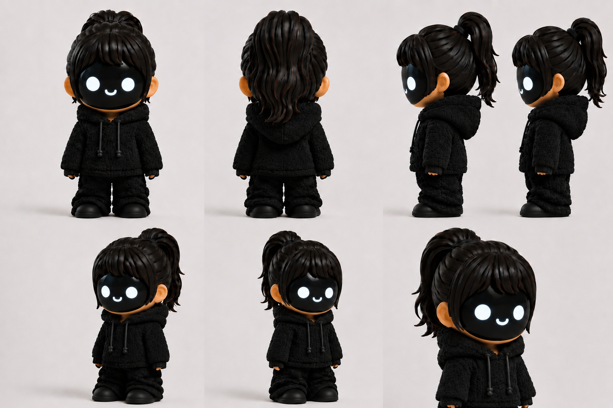

<div align="center">

# 💖 SMOOCH

### Your Own Companion

*An expressive AI companion that comes to life with personality—and can speak in a voice that's personal to you.*




</div>

---

# ✨ About

SMOOCH is a compact AI companion designed to create playful and emotional interactions through expressive facial animations, natural voice interactions, and a unique personality.

Unlike traditional smart assistants, SMOOCH is built to feel like a living character with its own attitude, charm, and emotions.

A key feature of SMOOCH is **Personalized Voice**. Customers can choose to have their companion shipped with a custom voice created from a voice sample they provide (with appropriate permission), making every SMOOCH a truly personal companion from the moment it arrives.

Whether placed on a desk, bedside table, or shelf, SMOOCH is designed to be more than a gadget—it's a companion.

---

# 🌟 Key Features

- 🤍 Cute collectible companion
- ❤️ Personalized voice
- 😊 Expressive animated face
- 🎙️ Natural voice interaction
- 💬 Personality-driven conversations
- 🎭 Dynamic facial expressions
- 🔋 Portable desktop companion
- 🧠 Character-focused experience

---

# ❤️ Personalized Voice

SMOOCH allows customers to personalize their companion with a custom voice.

By providing a voice sample with the necessary permission, your SMOOCH can be prepared to speak using that personalized voice before it is shipped, creating a companion that feels uniquely yours.

To protect proprietary technology, implementation details are intentionally not included in this repository.

---

# 🎯 Vision

Our vision is to make AI companionship feel genuinely personal.

SMOOCH combines expressive animations, personality, and personalized voices to create a character users can connect with emotionally. As the platform evolves, additional characters and personalities will expand the SMOOCH family while preserving the same core experience.

---

# 🚀 Project Status

Current development stage:

- ✅ Product concept
- ✅ Behaviour specification
- 🚧 Hardware development
- 🚧 Firmware development
- ⏳ Prototype manufacturing

---

# 📂 Repository Structure

```text
docs/
    Product_Overview.md
    Hardware_Overview.md
    Roadmap.md

images/
    smoooch_v1.png

assets/

firmware/
    README.md
```

---

# 📖 Documentation

This repository contains public documentation describing the product vision and high-level design.

Current documentation includes:

- Product overview
- Hardware overview
- Development roadmap

Detailed firmware architecture, source code, electronics design, and proprietary implementation details are intentionally excluded.

---

# ⚠️ Notice

This repository showcases the public vision of **SMOOCH**.

Technical implementation details, firmware, manufacturing data, and proprietary technologies are intentionally withheld.

---

# 📄 License

This project is proprietary.

All rights reserved.

No part of this repository may be copied, modified, or redistributed without prior written permission.

---

<div align="center">

### Made with ❤️ by **Yashas Dinesh**

*Not just another AI assistant. A companion that's truly yours.*

</div>
